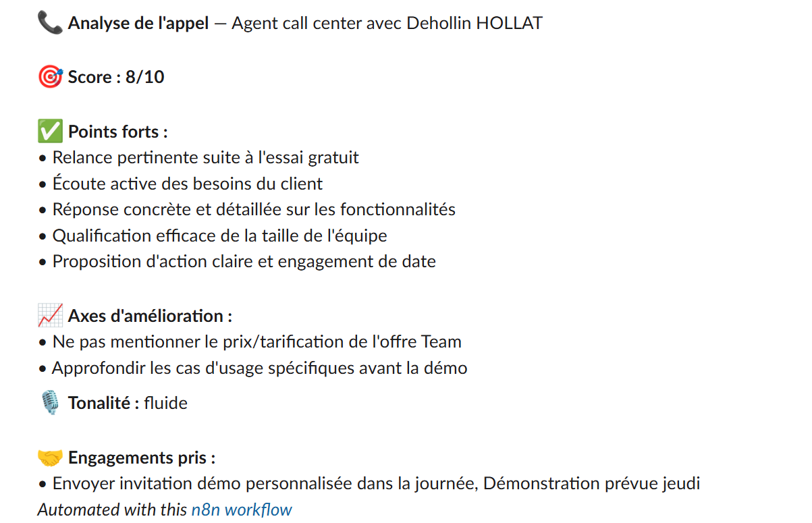
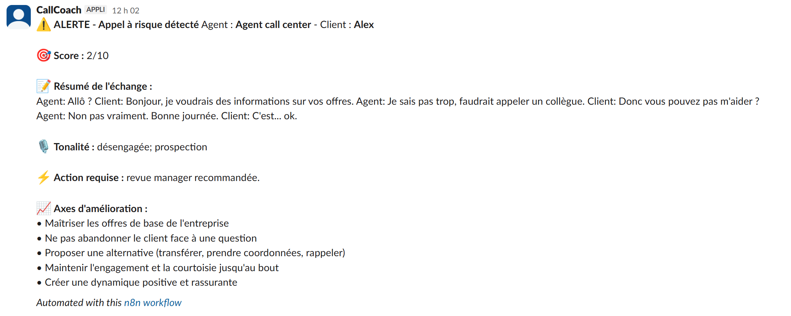
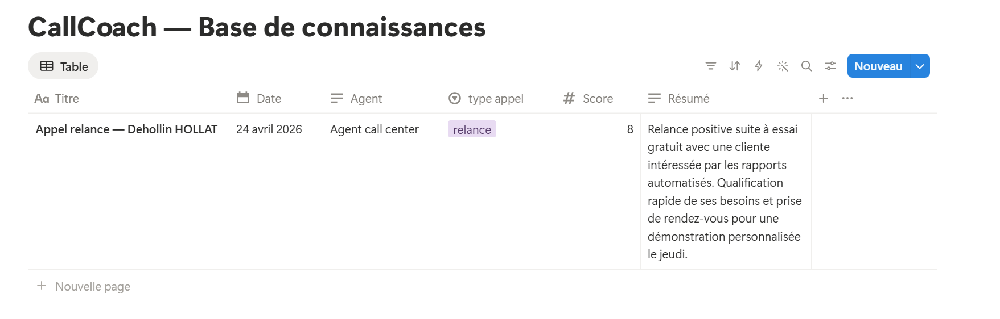

# CallCoach


> Agent IA post-call : analyse automatique des appels, email de suivi en brouillon Gmail, coaching Slack en temps réel et alertes manager.

---

## Présentation

CallCoach est un workflow d'automatisation intelligente qui se déclenche après chaque appel commercial ou support. Il analyse le contenu de l'échange, génère un email de follow-up personnalisé directement en brouillon Gmail, et envoie un rapport de coaching structuré à l'agent sur Slack. Les mauvais appels déclenchent une alerte immédiate au manager. Les meilleurs appels alimentent automatiquement une base de connaissances Notion.

Ce projet fait partie d'un portfolio Data & IA orienté automatisation et agents intelligents.

---

## Fonctionnalités

- **Email de suivi automatique** : brouillon Gmail généré par Claude après chaque appel, personnalisé selon l'historique client
- **Coaching en temps réel** : score /10, points forts, axes d'amélioration, tonalité et engagements pris envoyés sur Slack
- **Alerte manager** : notification immédiate sur channel dédié si score < 4
- **Bibliothèque d'objections** : toutes les objections clients stockées dans Google Sheets
- **Base de connaissances** : les meilleurs appels (score > 7) archivés automatiquement dans Notion
- **Mémoire client** : historique des appels passés injecté dans le prompt email
- **Reporting hebdomadaire** : synthèse agent + manager chaque lundi matin

---

## Stack technique

| Outil | Rôle |
|---|---|
| n8n (local) | Orchestration du workflow |
| Claude API (Haiku) | Génération email + analyse coaching |
| Gmail | Création des brouillons de suivi |
| Slack | Rapports coaching + alertes manager |
| Google Sheets | Historique appels + bibliothèque objections |
| Notion | Base de connaissances des meilleurs appels |
| JavaScript | Parsing JSON, logique métier, gestion cas vides |

---

## Architecture

```
Transcript (simulé ou Fireflies/Whisper)
              |
              v
     Mémoire client (Google Sheets)
              |
              v
     Claude API - Email follow-up
              |
              v
       Gmail - Brouillon
              |
              v
     Claude API - Analyse coaching
              |
              v
  Google Sheets - Objections + Historique
              |
         [IF score < 4]
         /            \
  Alertes Manager   Coaching Slack
                         |
                   [IF score > 7]
                         |
                       Notion
```

---

## Structure du repo

```
callcoach/
├── n8n/
│   ├── workflow_callcoach.json
│   └── workflow_reporting_hebdo.json
├── prompts/
│   ├── email_followup.md
│   └── coaching_analysis.md
├── assets/
│   ├── cas_faible.png
│   ├── cas_moyen.png
│   ├── cas_bon.png
│   ├── alerte_manager.png
│   ├── coaching_slack.png
│   └── notion_base_connaissances.png
├── docs/
│   └── METHODOLOGIE.md
└── README.md
```

---

## Lancer le projet

### Prérequis

- [n8n](https://n8n.io) installé en local (`npx n8n`)
- Clé API Anthropic
- Compte Gmail connecté en OAuth2 dans n8n
- Workspace Slack avec un bot configuré (`chat:write`)
- Google Sheets avec les onglets `objections` et `historique`
- Intégration Notion avec accès à la database cible

## Aperçu

### Coaching Slack


### Alerte Manager


### Base de connaissances Notion


### Installation

```bash
# Lancer n8n
npx n8n

# Ouvrir l'interface
http://localhost:5678
```

1. Importer `n8n/workflow_callcoach.json` dans n8n
2. Configurer les credentials (Anthropic, Gmail, Slack, Google Sheets, Notion)
3. Mettre à jour le node **Edit Fields** avec le transcript et les noms souhaités
4. Exécuter le workflow

---

## Cas de test

Trois scénarios sont documentés pour valider le workflow de bout en bout :

| Cas | Score attendu | Résultat |
|---|---|---|
| Appel faible - agent incapable de répondre | < 4 | Alerte `#alertes-manager` |
| Appel moyen - suivi insuffisant | 5–6 | Coaching `#coaching-calls` + Sheets |
| Bon appel - écoute active + engagement clair | > 7 | Coaching + Sheets + Notion |

---

## Évolutions prévues

- Intégration Fireflies (appels vidéo) ou Whisper (appels téléphoniques)
- Anonymisation RGPD automatique (workflow cron mensuel)
- Intégration CRM HubSpot Free

---

## Auteur

**Déhollin HOLLAT**
MBA Big Data & IA

[LinkedIn](https://linkedin.com/in/dehollin-hollat) · [GitHub](https://github.com/Dehollinhollat)
mailto:dehollin.hollat@outlook.fr 
